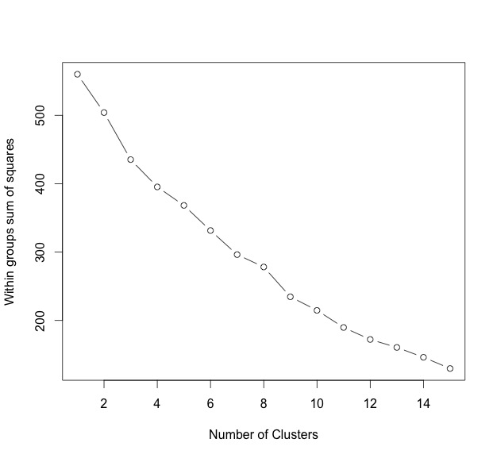
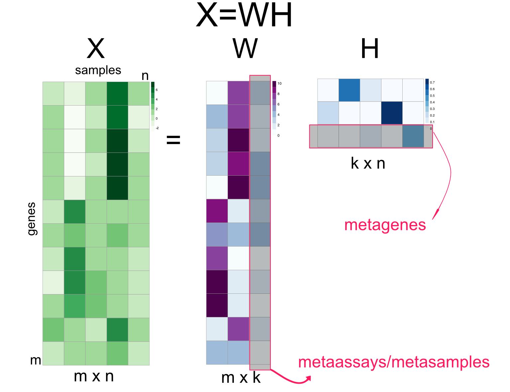
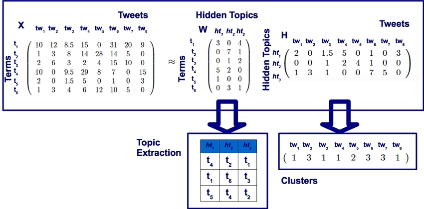
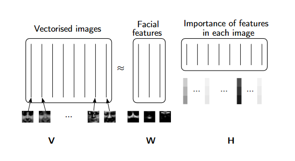
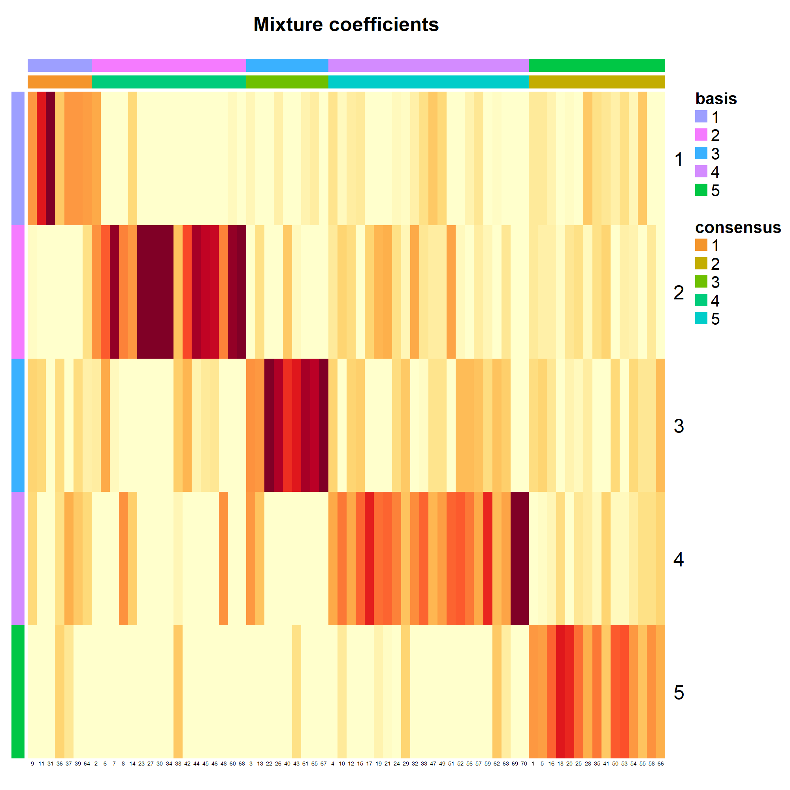
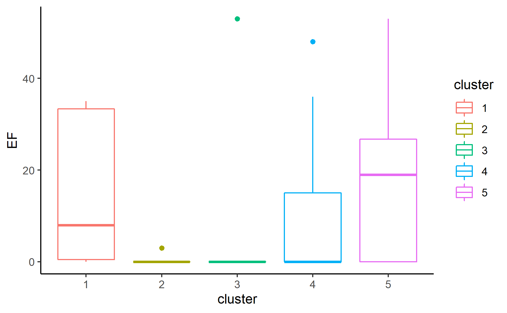

```{r setup, echo = FALSE, message = FALSE, warning = FALSE}
knitr::opts_chunk$set(echo = FALSE, eval = FALSE, message = FALSE, dpi = 72)
library(icons)      ## for FontAwesome icons (ozunconf17 project!)
library(emo)       ## for emoji, obvs (github.com/hadley/emo)
library(tidyverse) ## for data wrangling
```


---
name:introduccion

# Introducción

### Cada vez se tiene acceso a metadatos de los estudiantes que permiten una mejor identificación de su perfil `r icon_style(fontawesome("search", style = "solid"), scale = 0.8, fill = "#0067a2")`

- Plataformas de gestión de aprendizaje LMS (learning management system)
    - [Moodle](https://moodle.org)
- Implantación del EEES
    - Evaluación continua $\rightarrow$  `r emo::ji('arrow_up')` pruebas y actividades

<ru-blockquote>Se tiene acceso no solo a las calificaciones del estudiante sino también del comportamiento del alumnmo dentro de la plataforma</ru-blockquote>


---
class: inverse, center, middle
name: objetivo
## Objetivo

>Analizar los datos recopilados por la asignatura Matemáticas II para la Economía en el Grado de Economía de la Universidad de Las Palmas de Gran Canaria con el fin de construir un sistema de clustering basado en aprendizaje automático que diferencie los distintos perfiles  de aprendizaje a partir de los registros de uso de la plataforma Moodle.

---
background-image: url("img/registros.jpg")
background-size:contain
## Registros en moodle

---
name:asignatura
# Actividades en la asignatura (36)


.pull-left[
- Tema 1 
    - PDF Ejercicios [EPDF_T1]
    - PDF Prácticas DERIVE [PPDF_T1]
    - Vídeos sesiones prácticas(3) [PVi_T1]
    - Cuestionario [num1,media1,max1]
- Tema 2
    - PDF Ejercicios [EPDF_T2]
    - PDF Prácticas DERIVE [PPDF_T2]
    - Vídeos sesiones prácticas(2) [PVi_T2]
    - Cuestionario [num2,media2,max2]
        
]

.pull-right[
- Tema 3
    - PDF Ejercicios [EPDF_T3]
    - PDF Prácticas DERIVE(2) [PPDFi_T3]
    - Vídeos sesiones prácticas(3) [PVi_T3]
    - Cuestionario [num3,media3,max3]
- Tema 4
    - PDF Ejercicios [EPDF_T4]
    - PDF Prácticas LINGO(2) [PPDFi_T4]
    - Vídeos sesiones prácticas(3) [PVi_T2]
    - Cuestionario [num4,media4,max4]
        
]

3 pruebas objetivas [POP1,POT,POP2]
---
class: inverse, center, middle

¿Podríamos detectar al alumno que lo 'deja todo para el final'? (50)

---

class: inverse, center, middle
name:metodologia

# Metodología

---

### Primera aproximación
#### Algoritmo de clusterización de K-means

Problema: La matriz de datos es demasiado dispersa

Resultado: Solo detecta un único cluster

.pull-left[
```{r, eval = TRUE, out.height = "250px", fig.align = "center"}

```
]

--

.pull-right[
```{r, eval = TRUE, out.height = "250px", fig.align = "center"}

```
]
---

# NMF (Non-negative Matrix Factorization) [`r icon_style(fontawesome("sign-out-alt", style = "solid"),fill="#0067a2", scale = 0.5)`](https://en.wikipedia.org/wiki/Non-negative_matrix_factorization) 

- NMF factoriza una matriz $X_{m\times n}$ en dos matrices, $W_{m\times k}$ y $H_{n \times m}$ donde $k$ es el número de factores.
- Restricciones `r emo::ji("right")` los valores de $X,W,H$ deben ser no negativos.

.pull-left[

```{r, eval = TRUE, fig.cap="Altuna Akalin: (2020): <i>Computacional Genomics with R</i>", out.height = "250px",out.width = "250px", fig.align = "center"}

```
]


.pull-right[
- $X$: La matriz de datos $m \times n$
  - $m$ características (filas)
  - $n$ observaciones (columnas)
- $W$: Matriz diccionario $m \times k$
  - $w_{k}$ es un vector básico entre los K factores
- $H$: Matriz activación $k \times n$
  - $h_{n}$ es un vector que contiene los coeficientes de activación para la observación $v_n$
  - $h_{n}$ es un vector que contiene los coeficientes de activación relacionados con el vector básico $w_k$

]


---


### Principales campos de aplicación `r emo::ji("right_arrow_curving_down")`

.pull-left[
- Tratamiento de textos
    - Obtención de los tópicos subyacentes en los documentos


```{r, eval = TRUE, fig.cap="Casalino, G., Catiello, C., et. al.: (2017): <i>Intelligent Twitter Data Analysis Based on Nonnegative Matrix Factorizations</i>; 188-202", out.height = "250px", fig.align = "center"}

```
]

.pull-right[
- Tratamiento de imágenes (compresión)


```{r, eval = TRUE, fig.cap="Essid, S & Ozerov A.: (2014): <i>A TUTORIAL ON NONNEGATIVE MATRIX FACTORISATION WITH APPLICATIONS TO AUDIOVISUAL CONTENT ANALYSIS</i>", out.height = "250px", fig.align = "center"}

```
]

<ru-blockquote>Permite extraer las características de los datos como vectores básicos en $W$, pudiéndose usar para clusterización o compresión</ru-blockquote>

---
## Matriz W

```{r, eval = TRUE, out.height = "500px",out.width = "600px", fig.align = "center"}
factores <- readRDS('data/factores.RDS')
ggplot(factores, aes(y = tidytext::reorder_within(actividad, peso, factor), x = peso)) +
  geom_col(fill = "#0067a2") +
  facet_wrap(vars(factor), scales = "free_y") +
  theme(panel.grid.major = element_blank(), panel.grid.minor = element_blank(),
        panel.background = element_blank(), axis.line = element_blank()) +
  labs(y = "", x = "", title = "")
```
---

# Factores

- Factor `r emo::ji("one")`: Se descarga principalmente ejercicos en PDF (antes y después)
- Factor `r emo::ji("two")`: Se descarga principalmente cuadernillos de prácticas en PDF (antes)
- Factor `r emo::ji("three")`: Visualiza los vídeos (antes)
- Factor `r emo::ji("four")`: Realiza varios cuestionarios y obtiene calificaciones elevadas
- Factor `r emo::ji("five")`: Altas calificaciones en las pruebas


---
## Matriz H

```{r, eval = TRUE,  out.height = "500px",out.width = "780px", fig.align = "center"}

```

---

## Resultados EF por cluster

```{r, eval = TRUE,  out.height = "500px",out.width = "780px", fig.align = "center"}

```
---
name:conclusiones

# Conclusiones

- Se utilizaron datos de uso de la plataforma Moodle para conocer los hábitos de estudio de los alumnos.
- Se consiguió clasificar a los alumnos en función de esos datos juntos con su calificación en pruebas evaluables.
- Esto nos permite dar perfiles de estudiantes que asociamos a su comportamiento en el examen final.

## Discusión y Líneas futuras
- Ampliarlo a otras asignaturas de Economía para detectar si sigue el mismo comportamiento.
- Utilizar mecanismos dentro del clustering que permita la clasificación del alumno en etapas tempranas del curso y así tener tiempo para actuar.
---
class: middle, center
background-image: url("img/version_max_red_azul_mancheta.jpg")
background-size: 50%
background-position: 9% 15%

# ¡Gracias!


